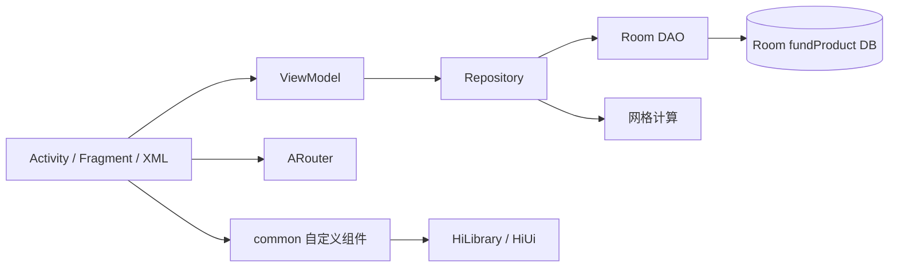
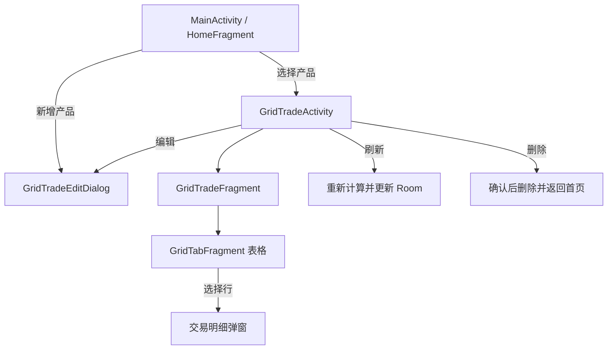
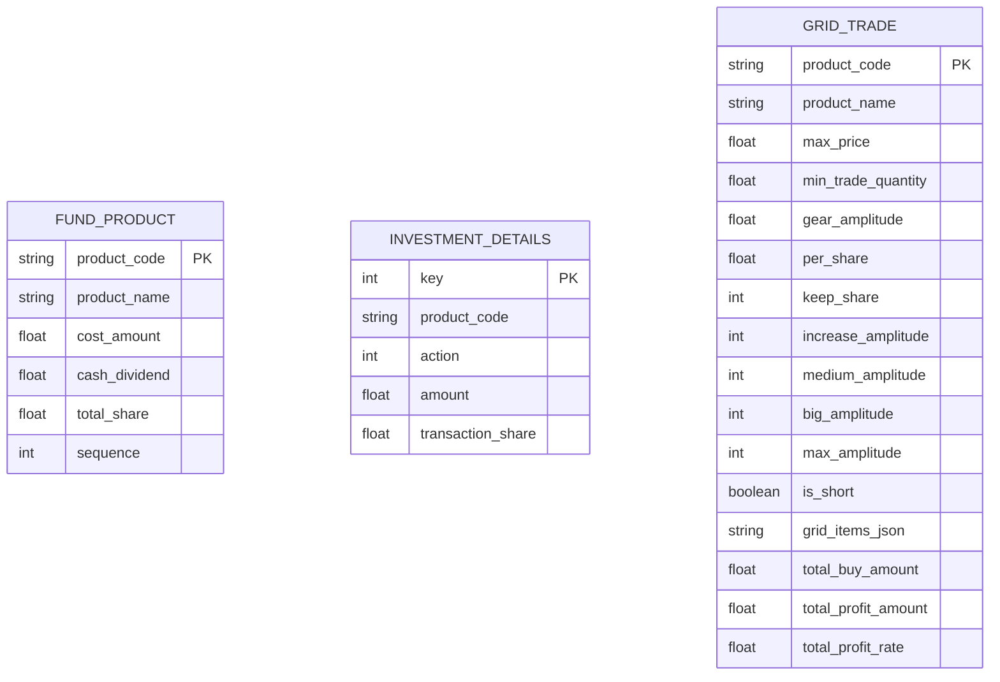
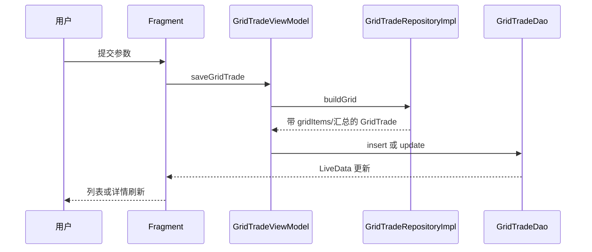

# 安卓项目审计

## 1. 审计基线与规模

| 项目 | 值 |
|---|---|
| 仓库 | `FitProj` |
| 分支 | `master` |
| 提交 | `a6452ac` |
| 标签 | `v2.1.0` |
| 应用版本 | `2.1.0` / versionCode `9` |
| 包名 | `com.zsy.fit`，Debug 后缀 `.debug` |
| Android SDK | min 23、target 30、compile 31 |
| 语言 | Kotlin，JVM target 1.8 |
| 模块 | `app`、`common` |
| 源码规模 | 83 个 Kotlin、58 个 XML，约 6,830 行 |

## 2. 构建与依赖

- Gradle Wrapper 6.5，Android Gradle Plugin 4.1.1。
- Kotlin Gradle Plugin 声明同时出现 `1.5.10` 与 `1.5.20`，运行时又解析到 `1.5.30`、`1.6.0`，存在版本混用警告。
- 主要依赖：AndroidX、Material、Room 2.4.0、Kotlin Coroutines、ARouter、Gson、TableView、HiLibrary/HiUi。
- 仓库仍声明 `jcenter()`，属于需要在未来维护中移除的旧仓库来源。
- 使用较旧 Oracle Java 8 `1.8.0_121` 下载 Maven 依赖会因证书链失败；切换 Zulu Java 8 `1.8.0_412` 后构建成功。

构建成功但有以下主要警告：

- Kotlin 标准库版本不一致。
- Room 和 ARouter 注解处理器不完全支持增量编译。
- `onActivityResult`、公共下载目录 API、`Resources.getColor` 已弃用。
- 算法类存在未使用变量、变量遮蔽和多处非空断言。

## 3. 模块职责

### `app`

- `ui/activity`：通用 Fragment 宿主、首页、网格详情、网格编辑弹窗。
- `ui/fragment/home`：搜索列表、分页、导入导出和进入详情。
- `ui/fragment/grid`：网格参数表单、计算表格、行详情弹窗。
- `viewmodel`：UI 状态与协程调用。
- `data/repository`：CRUD 和做多/做空算法。
- `data/database`：Room v4、实体、DAO 和迁移。
- `route`：两个现役 ARouter 路由。

### `common`

- Activity/Fragment 基类。
- `InputItemLayout`、`TextItemLayout` 等自定义表单组件。
- 浮动按钮、列表、空态等历史通用组件。
- 该模块包含大量当前网格主流程未使用的遗留 UI 基础设施。

## 4. 现役导航

ARouter 路由：

| 路由 | Activity | 用途 |
|---|---|---|
| `/grid_trade/details` | `GridTradeActivity` | 展示一个产品的网格表格 |
| `/grid_trade/edit` | `GridTradeEditDialog` | 新增或编辑产品 |

## 5. Room 数据库

数据库文件名为 `fundProduct`，当前版本为 4。

只有 `grid_trade` 仍有可到达 UI。`fund_product` 和 `investment_details` 的实体、DAO、Repository、ViewModel 与旧布局仍被编译，但页面入口已删除。

迁移历史：

- v1→v2：增加基金排序字段并创建 `grid_trade`。
- v2→v3：将档位幅度改为浮点数，增加最小交易数量、分类和排序。
- v3→v4：增加 `is_short`。

## 6. 数据与事件流

- 应用没有 Retrofit、OkHttp 或 WebView，不发起业务网络请求。
- 本地 `GridTrade` 同时保存输入参数和派生结果。
- 首页搜索查询使用 SQL `LIKE`、`LIMIT 20`、`OFFSET`。
- 导入使用 `Gson.fromJson<List<GridTrade>>`，写入时执行 `OnConflictStrategy.REPLACE`。

## 7. 现役与遗留判定

提交 `d228fff`（2025-12-25，说明为“改版”）删除了以下页面：

- `EditFundProductActivity`
- `DetailsActivity`
- `EditDetailsDialog`
- `FundProductDetailsActivity`
- `FundProductManageActivity`
- 对应的 product/details Fragment 和列表实现

Manifest 仍声明这些 Activity，旧实体、Repository、ViewModel 和 XML 也仍存在。Android Gradle Plugin 4.1.1 的本次 Debug 构建未因此失败，但这些组件已经没有类实现，任何显式启动都会失败。Web 首期不得根据残留资源恢复这些功能。

## 8. 已确认缺陷与 Web 处理

| 安卓现状 | 风险 | Web 目标 |
|---|---|---|
| 表单主要只校验非空 | 0、负数、极端值可能崩溃或生成异常规模数据 | 服务端完整范围校验，客户端同步提示 |
| 做多档位幅度为 0 会产生极大循环风险 | 除零后转为超大整数 | 请求在进入算法前拒绝 |
| 编辑时以产品代码作为 Room 主键 | 修改产品代码时可能无法匹配原记录 | 使用稳定 UUID，产品代码可安全修改 |
| 导入同代码数据直接 REPLACE | 静默覆盖 | 预检后显式选择跳过或覆盖 |
| 列表分页没有 `ORDER BY` | 重复、遗漏、顺序漂移 | 基于 `sortOrder/createdAt/id` 的稳定游标 |
| 导出直接写公共 Downloads | 新版 Android 可能受存储限制 | 浏览器标准下载；服务端不写用户本地目录 |
| Float 贯穿算法和存储 | 精度与跨语言差异 | 十进制定点领域模型，锁定每一步取整 |
| 派生行和汇总长期存储 | 参数或算法升级后可能过期 | 只保存输入和算法版本，服务端重算 |
| 无账号与访问控制 | 只能单机使用 | 强制 owner 作用域和服务端授权 |
