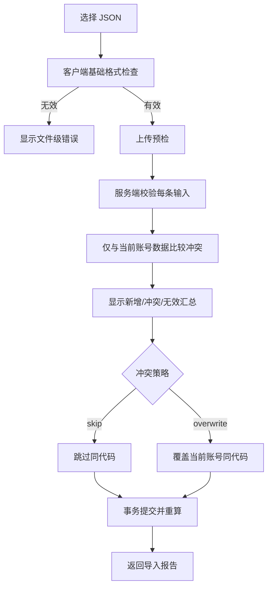

# 现役功能规格

## 1. 角色

| 角色 | 能力 |
|---|---|
| 未登录访客 | 登录、接受有效邀请、查看健康状态；不能访问产品数据 |
| 普通用户 | 只管理自己的网格产品、导入自己的数据、导出自己的备份 |
| 管理员 | 普通用户能力，加上邀请、账号列表、禁用/启用账号；默认不能读取其他用户产品 |

## 2. 页面与信息架构

### 2.1 登录

- 输入用户名与密码。
- 成功后进入产品列表。
- 失败统一显示“用户名或密码错误”，不泄露账号是否存在。
- 被禁用账号不能建立新会话，既有会话在下一次校验时失效。

### 2.2 接受邀请

- 打开一次性邀请 URL。
- 展示邀请状态：有效、已使用、已过期或无效。
- 有效时设置用户名和密码；成功后邀请立即失效并进入登录页。

### 2.3 产品列表

安卓现状包含：

- 搜索框：按产品名称或产品代码搜索。
- 清除搜索按钮。
- 列表字段：产品名称、产品代码、最高价、每份金额。
- 下拉刷新。
- 滚动到底加载下一页，每页 20 条。
- 菜单：新增产品、导入、导出。
- 选择产品进入网格详情。

Web 功能等价要求：

- 手机可使用连续列表；PC 可使用更适合宽屏的表格或列表，但字段和操作一致。
- 默认使用稳定游标分页；筛选条件改变时清空游标。
- 空列表显示“还没有网格产品”和新增/导入入口。
- 搜索无结果与账号无产品是两个不同空态。
- 加载、刷新、分页失败应保留现有数据并提供重试。
- 列表只返回当前账号记录。

### 2.4 新增/编辑产品

字段定义：

| 字段 | Android 默认值 | 必填 | Web 规则 |
|---|---:|---|---|
| 产品名称 | 空 | 否 | 去除首尾空格，最多 120 字符 |
| 产品代码 | 空 | 是 | 当前账号内唯一，1–64 字符 |
| 最高价格 `maxPrice` | 1 | 是 | 十进制，`> 0` |
| 最小交易数量 `minTradeQuantity` | 100 | 是 | 十进制，`> 0` |
| 档位幅度 `gearAmplitude` | 5 | 是 | 百分数，`> 0` 且 `<= 100` |
| 每份金额 `perShare` | 2000 | 是 | 十进制，`> 0` |
| 最大振幅 `maxAmplitude` | 60 | 是 | 整数百分数，`> 0` 且 `<= 100` |
| 是否做空 `isShort` | 否 | 是 | 布尔值 |
| 留存份数 `keepShare` | 2 | 做多可选 | 非负整数；做空时归零且忽略 |
| 加码幅度 `increaseAmplitude` | 5 | 否 | 非负整数百分数，空值按 0 |
| 中网幅度 `mediumAmplitude` | 15 | 做多可选 | 提供时必须 `> 0`；做空时置空 |
| 大网幅度 `bigAmplitude` | 30 | 做多可选 | 提供时必须 `> 0`；做空时置空 |

交互规则：

- 切换做空时隐藏留利润、中网和大网输入，但不允许隐藏值影响计算。
- 新增成功返回列表并出现新产品。
- 编辑使用稳定记录 ID，因此允许修改产品代码。
- 与当前账号其他记录代码冲突时返回字段错误；其他账号的同代码不冲突。
- 服务端重新计算并返回完整详情，客户端计算只能用于非权威预览。
- 关闭或取消有未保存修改时需要二次确认。

### 2.5 网格详情

- 标题使用产品名称；名称为空时使用产品代码。
- 顶部操作：重新计算、编辑、删除。
- 表格列：序号、种类、档位、买入/卖出价格和数量、买入/卖出金额、盈利金额、盈利比例、本期留存利润、本期留存数量。
- 做空模式交换买入与卖出相关列的展示顺序。
- 最后一行是汇总行：买入总金额、总盈利、总盈利率。
- 小网、中网、大网使用可区分的语义标识；颜色由后续视觉设计决定。
- PC 应充分利用宽度；手机允许水平滚动，并保持序号或关键列可辨认。

重新计算：

- 使用数据库中当前输入参数和 `android-v2.1.0` 算法。
- 不改变产品 ID、所有者或输入参数。
- 相同输入重复计算结果必须完全一致。

删除：

- 显示产品名称/代码和不可撤销提示。
- 确认后只删除当前账号的指定记录。
- 记录不存在或属于其他账号时统一返回 404。

### 2.6 行明细

- 选择非汇总行打开明细。
- 展示网格类型、当前序号/总数、买入价格/数量、卖出价格/数量。
- 做空时交换标签顺序和买卖语义。
- 支持上一笔、下一笔；首尾按钮禁用。
- 切换行时同步表格选中状态。

### 2.7 导入

- 支持 Android 原始数组格式与 Web 版本化备份格式。
- 不信任导入文件中的 `ownerId`、网格行或汇总值。
- 预检令牌短期有效，提交时再次校验目标账号和文件摘要。
- 任一数据库错误导致整个提交回滚。

### 2.8 导出

- Android 兼容导出：当前账号的 `GridTrade[]`，包含重新计算后的网格行和汇总值。
- Web 完整备份：包含格式版本、导出时间、算法版本、账号标识摘要和当前账号产品。
- 不提供“全部用户导出”业务接口，管理员也不能通过普通管理页导出其他用户产品。

## 3. 通用状态

| 状态 | 要求 |
|---|---|
| 未认证 | 返回 401，前端转登录并保留安全的返回地址 |
| 无权限/跨账号 | 返回 404，不区分不存在与无权访问 |
| 字段错误 | 422，字段旁提示并保留用户输入 |
| 唯一冲突 | 409，定位产品代码字段 |
| 请求过快 | 429，显示可重试时间 |
| 服务异常 | 500，显示请求 ID，不暴露堆栈 |
| 网络中断 | 保留当前页面和未提交表单，允许重试 |

## 4. 功能级响应式原则

- 手机与 PC 使用同一业务路由、同一 API 和同一权限规则。
- 手机优先保障单手操作、水平表格可读和表单分组。
- PC 优先保障搜索、列表、详情和操作的并列信息效率。
- 不在本规格中固定字体、品牌色、阴影、卡片样式或动画。
