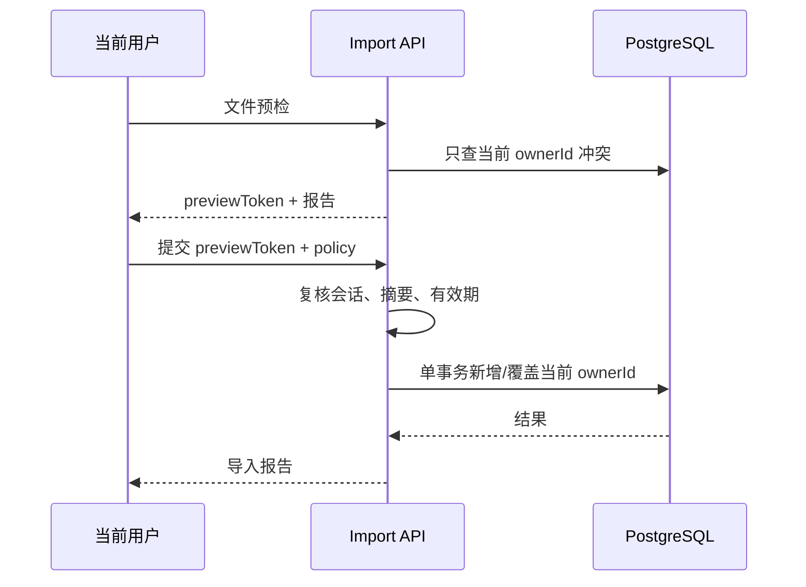

# 数据迁移与兼容规格

## 1. Android 导出格式

Android v2.1.0 导出的是没有包裹对象的 `GridTrade[]`：

```json
[
  {
    "productName": "示例产品",
    "productCode": "DEMO001",
    "maxPrice": 1.0,
    "perShare": 2000.0,
    "gearAmplitude": 5.0,
    "keepShare": 2,
    "increaseAmplitude": 5,
    "mediumAmplitude": 15,
    "bigAmplitude": 30,
    "maxAmplitude": 60,
    "minTradeQuantity": 100.0,
    "category": "",
    "sortOrder": 0,
    "totalBuyAmount": 53225.0,
    "totalProfitAmount": 9880.0,
    "totalProfitRate": 0.1856,
    "gridItems": [],
    "isShort": false
  }
]
```

Android 没有格式版本、账号标识、导出时间或校验摘要。

## 2. 历史兼容

Room 与 Git 历史显示字段分阶段加入。导入器必须支持：

| 字段 | 缺失时默认值 | 原因 |
|---|---:|---|
| `minTradeQuantity` | `100` | v3 增加 |
| `category` | `""` | v3 增加，当前 UI 未使用 |
| `sortOrder` | `0` | v3 增加，当前列表未稳定使用 |
| `isShort` | `false` | v4 增加 |
| `gridItems` | 忽略并重算 | 派生字段，不可信 |
| `totalBuyAmount` | 忽略并重算 | 派生字段，不可信 |
| `totalProfitAmount` | 忽略并重算 | 派生字段，不可信 |
| `totalProfitRate` | 忽略并重算 | 派生字段，不可信 |

`productName` 可以为空。`productCode`、`maxPrice`、`perShare`、`gearAmplitude` 和 `maxAmplitude` 缺失时该条记录无效，不能猜测。

## 3. 字段映射

| Android JSON | Web 数据库 | API 类型 | 处理 |
|---|---|---|---|
| 无 | `id` | UUID | 服务端生成，导入覆盖时保留现有 ID |
| 无 | `ownerId` | UUID | 强制取当前会话，禁止从文件提供 |
| `productName` | `productName` | string/null | trim，空串归一化为 null |
| `productCode` | `productCode` | string | trim，当前账号内唯一 |
| `maxPrice` | `maxPrice` | decimal string | 转十进制定点数 |
| `minTradeQuantity` | `minTradeQuantity` | decimal string | 缺失默认 100 |
| `gearAmplitude` | `gearAmplitude` | decimal string | 接受历史整数或浮点数 |
| `perShare` | `perShare` | decimal string | 转十进制定点数 |
| `keepShare` | `keepShare` | integer | 缺失默认 0；做空归零 |
| `increaseAmplitude` | `increaseAmplitude` | integer | 缺失默认 0 |
| `mediumAmplitude` | `mediumAmplitude` | integer/null | 做空置空；做多的 0 归为无效而非除零 |
| `bigAmplitude` | `bigAmplitude` | integer/null | 做空置空；做多的 0 归为无效而非除零 |
| `maxAmplitude` | `maxAmplitude` | integer | 范围校验 |
| `category` | `category` | string/null | 兼容保存但首期 UI 不展示 |
| `sortOrder` | `sortOrder` | integer | 兼容保存；缺失使用导入顺序 |
| `isShort` | `isShort` | boolean | 缺失为 false |
| 派生字段 | 无持久列 | 响应中派生 | 按算法版本重算 |
| 无 | `algorithmVersion` | enum | Android 导入固定为 `android-v2.1.0` |

## 4. 导入预检

### 4.1 文件级校验

- 最大文件 10 MiB。
- 最大 5,000 条产品。
- 必须是 UTF-8 JSON。
- 顶层必须符合 Android 数组 Schema 或 Web 备份 Schema。
- 拒绝重复 JSON key、非有限数字、超长字符串和超出精度的十进制值。
- 计算 SHA-256 摘要，生成最长 15 分钟有效的预检令牌。

### 4.2 记录级校验

- 归一化字段并执行 [算法输入校验](03-grid-algorithm.md#6-输入校验与防护)。
- 同一文件内重复 `productCode` 记为冲突，不能静默选择最后一条。
- 仅查询 `(当前 ownerId, productCode)` 判断数据库冲突。
- 不查询、比较或泄露其他账号的产品。
- 对有效输入运行算法；文件自带派生结果只用于生成差异提示，不影响落库。

预检响应分组：

- `creates`：可新增。
- `conflicts`：与当前账号已有产品代码冲突。
- `invalid`：字段或算法校验失败。
- `warnings`：派生结果与重算不一致、旧字段默认补齐等非阻断信息。

## 5. 导入提交

提交必须携带预检令牌和 `skip|overwrite` 冲突策略：



- `skip`：跳过当前账号同代码记录。
- `overwrite`：更新当前账号同代码记录，但保留其稳定 UUID、创建时间和所有者。
- `invalid` 永不提交。
- 提交全程使用单数据库事务；任何异常全部回滚。
- `ownerId` 仅来自当前数据库会话。
- 预检令牌不能跨账号使用。

## 6. Android 兼容导出

- MIME：`application/json; charset=utf-8`。
- 文件名：`fit_android_grid_YYYYMMDD_HHmmss.json`。
- 顶层为数组，不添加 Web 元数据。
- 只导出当前账号产品。
- 导出前按每条记录的算法版本重新计算。
- v2.1.0 Android 不认识 Web UUID、`ownerId`、时间戳和备份元数据，因此不得输出这些字段。
- 十进制最终值转 JSON 数字；字段命名和 `GridTrade` Gson 一致。

## 7. Web 完整备份

Web 备份使用版本化包裹对象：

```json
{
  "format": "fitgridweb-backup",
  "formatVersion": "1.0.0",
  "exportedAt": "2026-09-01T00:00:00Z",
  "ownerRef": "hmac-sha256:0123456789abcdef0123456789abcdef0123456789abcdef0123456789abcdef",
  "products": []
}
```

- `ownerRef` 是账号 ID 的带应用密钥 HMAC 摘要，不包含用户名或原始 ID，只用于提示备份来源。
- 恢复时所有产品重新绑定当前账号，绝不恢复原 `ownerId`。
- 备份保存输入参数、稳定导出 ID、算法版本和时间戳，不保存会话、密码、邀请或管理员信息。
- 十进制使用字符串，保证往返一致。
- 完整数据库灾难恢复使用 PostgreSQL 备份，不使用用户级 Web JSON 替代。

## 8. 迁移验收

- v2、v3、v4 形状均可预检，缺失字段按表格补齐。
- Android 导出→Web 导入→Android 导出，输入和算法结果保持等价。
- 账号 A 的导入、冲突报告和导出不得包含账号 B 数据。
- 用户删除或修改导入文件中的 `ownerId` 不影响归属，因为该字段根本不被接受。
- 覆盖导入不会改变记录 UUID、所有者和创建时间。
- 损坏 JSON、超限文件和非法算法参数不能产生部分写入。
