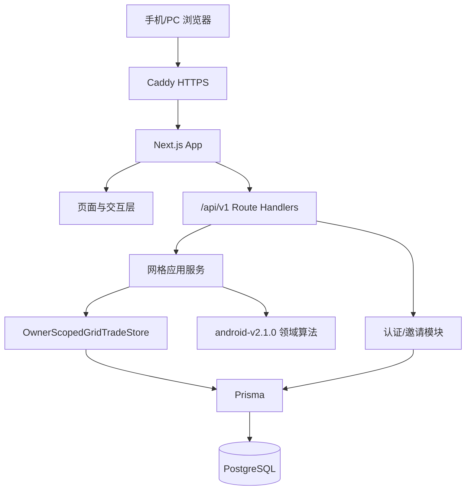
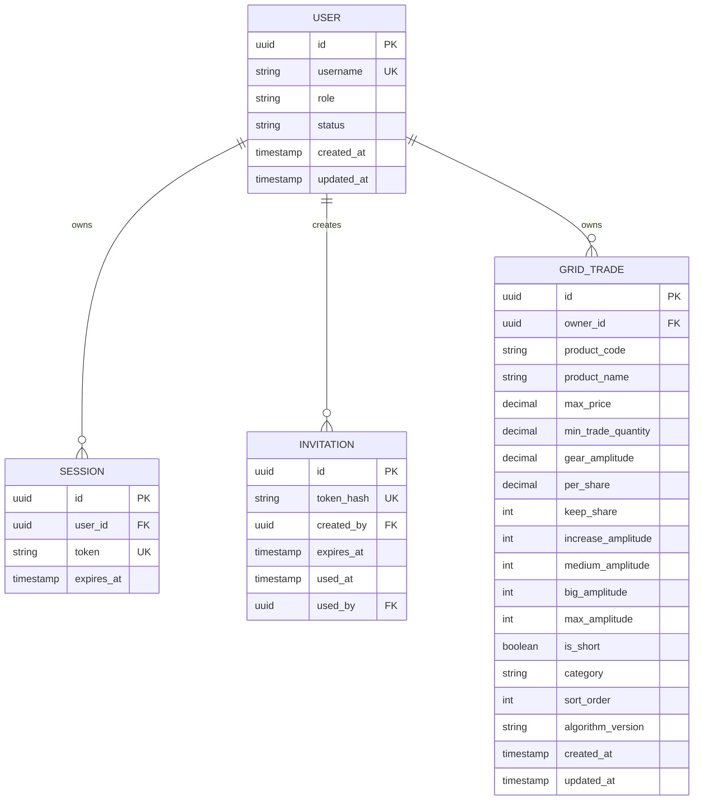
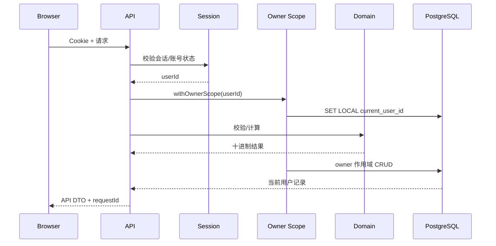

# Web 目标架构

## 1. 架构选择

采用 TypeScript 模块化单体：

- Next.js：页面、同源 API、服务端渲染和运行时。
- PostgreSQL：唯一权威数据源。
- Prisma：类型化数据访问与版本化迁移。
- Better Auth：用户名/密码、数据库会话和安全 Cookie。
- Caddy：反向代理和自动 HTTPS。
- Docker Compose：Ubuntu VPS 单机编排。

选择模块化单体而不是前后端双服务，可以减少部署、跨域、认证和版本协调成本；同时保留 `/api/v1` 和独立领域层，未来可拆分 API 或增加其他客户端。

## 2. 组件边界



### 模块

| 模块 | 职责 | 禁止事项 |
|---|---|---|
| `auth` | 登录、会话、改密、账号状态 | 不读取产品数据 |
| `invitations` | 创建、校验、消费一次性邀请 | 不创建公开注册入口 |
| `grid-domain` | 输入类型、校验、十进制算法、版本分发 | 不访问数据库或请求对象 |
| `grid-application` | CRUD、导入、导出、重新计算 | 不接受客户端 ownerId |
| `grid-persistence` | 所有者作用域查询与事务 | 不导出无作用域 Prisma Client |
| `admin` | 账号、邀请、启禁用 | 不提供跨用户产品浏览 |
| `ops` | 健康、日志、迁移、备份 | 不返回秘密或用户数据 |

## 3. 领域接口

所有十进制字段以 `DecimalString` 表达：

```ts
type DecimalString = string;
type AlgorithmVersion = "android-v2.1.0";

interface GridTradeInput {
  productName: string | null;
  productCode: string;
  maxPrice: DecimalString;
  minTradeQuantity: DecimalString;
  gearAmplitude: DecimalString;
  perShare: DecimalString;
  keepShare: number;
  increaseAmplitude: number;
  mediumAmplitude: number | null;
  bigAmplitude: number | null;
  maxAmplitude: number;
  isShort: boolean;
  category: string | null;
  sortOrder: number;
  algorithmVersion: AlgorithmVersion;
}

interface GridItemResult {
  sequence: number;
  gridType: 1 | 2 | 3;
  gear: DecimalString;
  buyPrice: DecimalString;
  buyCount: DecimalString;
  buyAmount: DecimalString;
  sellPrice: DecimalString;
  sellCount: DecimalString;
  sellAmount: DecimalString;
  profitAmount: DecimalString;
  profitRate: DecimalString;
  keepProfit: DecimalString;
  keepCount: DecimalString;
}

interface GridCalculationResult {
  items: GridItemResult[];
  totalBuyAmount: DecimalString;
  totalProfitAmount: DecimalString;
  totalProfitRate: DecimalString;
}
```

领域入口固定为：

```ts
calculateGrid(input: GridTradeInput): GridCalculationResult
```

算法实现按 `algorithmVersion` 分发；未知版本返回 `ALGORITHM_VERSION_UNSUPPORTED`。

## 4. 数据模型



会话表采用 Better Auth 的标准数据库模型保存唯一 `token`。浏览器 Cookie 中的会话值仍由 `BETTER_AUTH_SECRET` 签名并使用 `HttpOnly`、`Secure` 与 `SameSite=Lax` 保护；日志和 API 响应不得输出 Cookie 或会话 token。邀请 token 与导入预检 token 不采用这一例外，数据库仍只保存其 SHA-256/HMAC 摘要。

数据库约束：

- `grid_trade.owner_id NOT NULL`，外键关联用户并在用户删除时限制删除；禁用账号不删除业务数据。
- 唯一索引 `(owner_id, product_code)`。
- 稳定分页索引 `(owner_id, sort_order, created_at, id)`。
- 搜索索引至少覆盖 `(owner_id, product_code)`；产品名称模糊搜索可使用 `pg_trgm`，数据量小阶段也可先使用带 owner 前缀的普通查询。
- 十进制列使用足够范围的 `numeric`，建议价格/金额 `numeric(30, 10)`；进入算法前仍执行应用层范围校验。
- 不保存 `gridItems` 和汇总字段。

## 5. 账号隔离

### 5.1 应用层

数据访问只能通过关闭了 `ownerId` 的仓储：

```ts
interface OwnerScopedGridTradeStore {
  list(query: GridTradeListQuery): Promise<GridTradePage>;
  findById(id: string): Promise<GridTradeRecord | null>;
  findByProductCode(code: string): Promise<GridTradeRecord | null>;
  create(input: GridTradeInput): Promise<GridTradeRecord>;
  update(id: string, input: GridTradeInput): Promise<GridTradeRecord | null>;
  delete(id: string): Promise<boolean>;
}

withOwnerScope<T>(ownerId: string, fn: (store: OwnerScopedGridTradeStore) => Promise<T>): Promise<T>;
```

- `ownerId` 来自服务端会话，不在请求 DTO 中出现。
- 禁止从通用模块导出可直接查询 `GridTrade` 的 Prisma Client。
- 详情、更新、删除返回 null 时统一映射到 404。
- 管理员使用同一 owner 作用域访问自己的产品，不获得绕过能力。

### 5.2 数据库层

在 PostgreSQL 启用并强制 Row Level Security：

```sql
ALTER TABLE grid_trades ENABLE ROW LEVEL SECURITY;
ALTER TABLE grid_trades FORCE ROW LEVEL SECURITY;

CREATE POLICY grid_trade_owner_policy ON grid_trades
USING (owner_id = current_setting('app.current_user_id', true)::uuid)
WITH CHECK (owner_id = current_setting('app.current_user_id', true)::uuid);
```

- 应用数据库角色不能拥有 `BYPASSRLS`。
- 每个业务事务先通过参数化查询调用 `set_config('app.current_user_id', ownerId, true)`。
- `withOwnerScope` 必须使用同一个 Prisma 交互事务完成设置和查询。
- 数据库迁移角色与应用运行角色分离。
- 导入事务也必须在相同 owner 上下文中运行。

数据库 RLS 是纵深防御，不能替代应用层鉴权；应用层作用域也不能成为关闭 RLS 的理由。

## 6. 请求数据流



## 7. 一致性与并发

- 更新请求携带 `updatedAt` 或版本号作为乐观锁；过期更新返回 409 `EDIT_CONFLICT`。
- 导入覆盖在单事务内锁定当前账号相关产品代码。
- 算法是纯函数；相同版本与输入必须产生相同输出。
- 列表游标编码 `sortOrder、createdAt、id`，并带签名防篡改。
- 删除为物理删除；首期没有交易审计或恢复站，不实现软删除。

## 8. 可观测性

- 每个请求生成或接受合法 `requestId`。
- 结构化日志记录路由、状态码、耗时、匿名化 userId 摘要和错误码。
- 日志不得记录密码、会话 token、邀请 token、完整导入文件或产品明细。
- `/api/v1/health` 只返回服务与数据库是否可用，不返回版本秘密或用户统计。
- 单 VPS 首期不引入 Redis、消息队列或独立对象存储。
