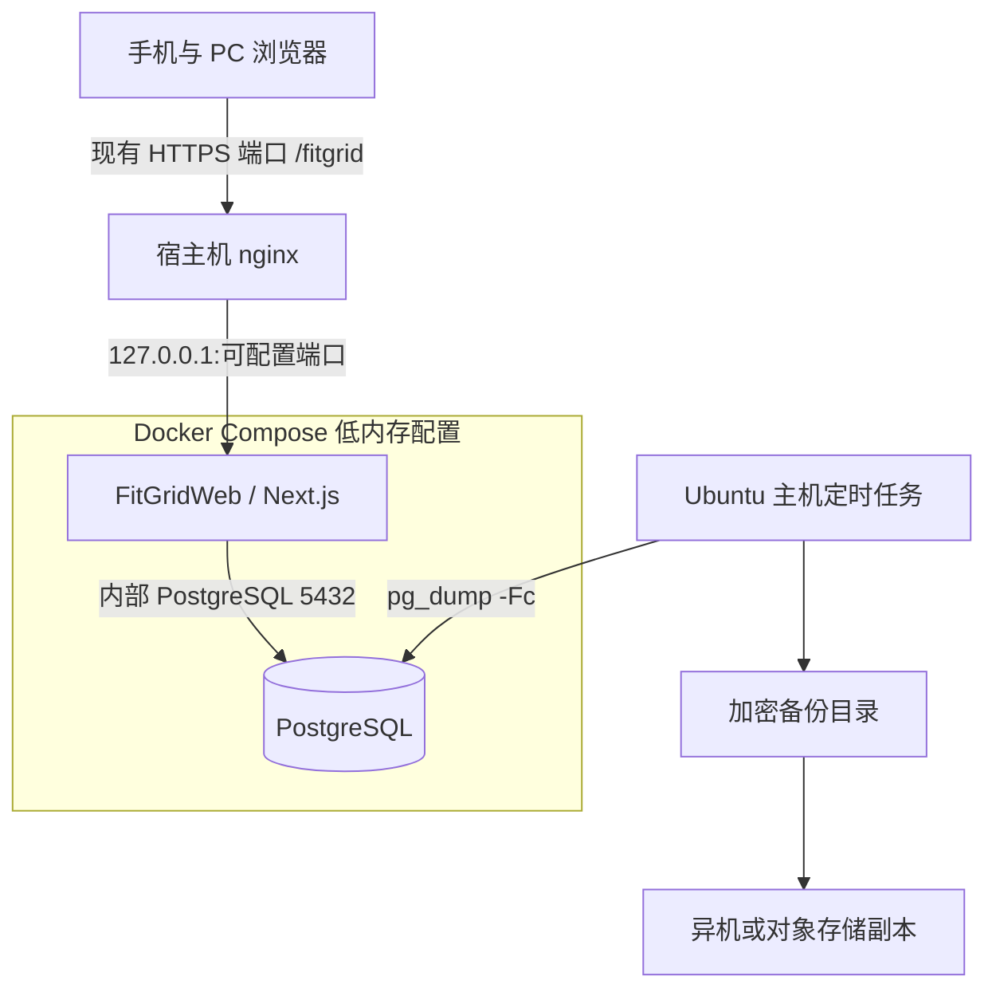
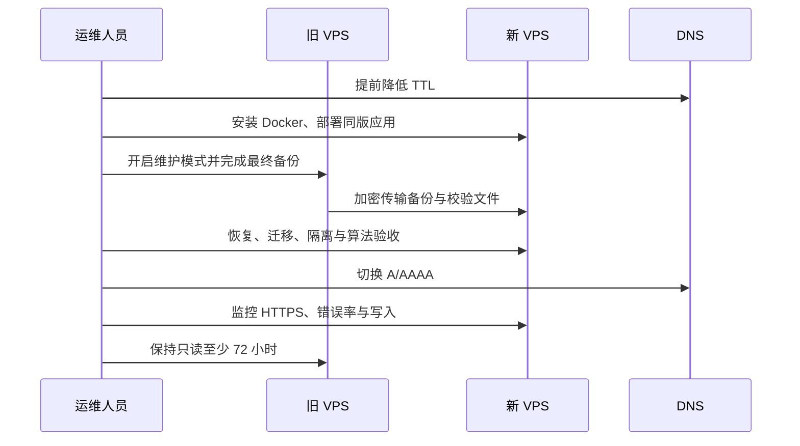

# Ubuntu VPS 部署、备份与迁移

> 当前小规模生产推荐方案是“现有 nginx + 固定 `/fitgrid` 子路径 + `docker-compose.low-memory.yml`”，完整实操以 [2 GiB VPS 一键部署与运维手册](low-memory-vps-runbook.md) 为准。仓库中的 Caddy 服务保留给独占域名/端口的独立部署，不会被低内存一键安装器启动。

## 1. 交付边界与命名

- 独立 GitHub 仓库名：`FitGridWeb`。
- 产品展示名：**F.I.T Grid Web**。
- 安卓仓库 `FitProj` 永远只作行为基线和兼容性取证，不作为 Web 仓库的 remote，也不接收 Web 提交。
- 本章定义 Web 实现阶段必须提供的 `compose.yaml`、`Dockerfile`、`Caddyfile`、`.env.example` 与 `ops/` 脚本行为；当前文档阶段不向安卓源码加入这些文件。
- 生产环境以云端 PostgreSQL 为唯一权威数据源，不支持浏览器离线写入或双向冲突合并。

## 2. 目标部署图



公网端口沿用现有 nginx 与 VPS 的实际配置，不由安装器写死或修改。Next.js 宿主映射只监听 `127.0.0.1`，PostgreSQL 只在 Compose 网络中可见；不得把 PostgreSQL 映射到公网。

## 3. 主机与 DNS 前置条件

建议最低配置为 Ubuntu 24.04 LTS、2 vCPU、2 GiB RAM、20 GiB SSD；实际容量按备份增长和访问量调整。

1. 创建仅使用 SSH 密钥的运维账号，禁用密码远程登录与 root 远程登录。
2. 确保现有 nginx vhost 已能通过 HTTPS 访问；Docker Engine 和 Compose plugin 可由安装器从 Docker 官方 apt 源安装。
3. 保持现有 SSH、防火墙、sing-box 和 nginx 监听策略；安装器不会更改这些配置。
4. 域名 A/AAAA 记录与已有 TLS 证书必须有效；安装器不签发或替换证书。
6. 将系统时区设为 UTC 或明确记录时区；应用与数据库时间统一存 UTC。

## 4. Compose 服务契约

| 服务 | 职责 | 必须配置 |
|---|---|---|
| `db` | PostgreSQL 权威存储 | 固定主版本、命名数据卷、`pg_isready` 健康检查、仅内部网络 |
| `app` | Next.js standalone 应用 | 非 root 用户、只读生产镜像、`/fitgrid/api/v1/health` 健康检查、宿主只绑定 loopback |
| 宿主 nginx | TLS 终止和反向代理 | 保留 `/fitgrid` 前缀并代理到 loopback；由用户选择现有单-server vhost |

基础 Compose 中的 `caddy` 是可选独立部署服务。低内存生产命令始终显式指定 `db app`，因此不启动 Caddy，也不占用公网 80/443。

应用镜像必须使用不可变版本标识，例如 Git 提交 SHA；禁止生产环境长期使用含义会变化的 `latest` 作为唯一回滚依据。数据库迁移角色与应用运行角色分离，运行角色不得拥有 `BYPASSRLS`。

## 5. 环境变量

`.env.example` 只列键名和安全说明，不含真实秘密。生产 `.env` 权限设为 `600`，不得提交 Git。

| 变量 | 用途 | 要求 |
|---|---|---|
| `DOMAIN` | 现有 nginx HTTPS 域名 | 不带协议、端口和路径 |
| `APP_BASE_PATH` | 生产子路径 | 固定 `/fitgrid` |
| `APP_PORT` | nginx 代理的本地端口 | 1024–65535，只绑定 loopback |
| `PUBLIC_HTTPS_PORT` | 现有 nginx HTTPS 端口 | 1–65535，不由安装器改写 |
| `APP_IMAGE` | 应用镜像及版本 | 公开 GHCR 的完整 SHA 标签 |
| `POSTGRES_DB` | 数据库名 | 生产专用 |
| `POSTGRES_USER` | 应用/所有者配置入口 | 不使用超级用户运行应用 |
| `POSTGRES_PASSWORD` | 数据库秘密 | 随机生成，不复用 |
| `DATABASE_URL` | Prisma 运行连接 | 仅容器内部地址 |
| `MIGRATION_DATABASE_URL` | 迁移连接 | 权限高于运行账号，单独保护 |
| `BETTER_AUTH_SECRET` | 会话签名/加密秘密 | 至少 32 随机字节 |
| `OWNER_REF_SECRET` | 用户备份 ownerRef HMAC | 与认证秘密分离 |
| `BACKUP_ENCRYPTION_KEY_FILE` | 备份加密密钥路径 | 主机 root 可读，不放环境值或 Git |
| `LOG_LEVEL` | 日志级别 | 生产默认 `info` |

更换 `BETTER_AUTH_SECRET` 会使既有会话失效；更换 `OWNER_REF_SECRET` 会改变未来导出的匿名 ownerRef。轮换前必须记录影响。

## 6. 首次部署

标准流程如下：

```bash
curl -fsSLo /tmp/fitgridweb-install.sh \
  https://raw.githubusercontent.com/zhshy7713950/FitGridWeb/main/ops/install-production.sh
less /tmp/fitgridweb-install.sh
sudo sh /tmp/fitgridweb-install.sh
```

`ops/install-production.sh` 按顺序完成：

1. 校验必填变量、镜像版本和目录权限，拒绝默认密码或空秘密。
2. 匿名确认完整 SHA 镜像公开可拉取，在 VPS 上只拉取、不构建 Next.js。
3. 启动 `db` 并等待健康。
4. 使用迁移账号执行 `prisma migrate deploy`；失败时停止，不启动新应用。
5. 启动 `app`，写入受管 nginx include 并用 `nginx -t` 验证。
6. 在 loopback 和公网分别检查 `/fitgrid/api/v1/health`。
7. 输出部署版本、迁移版本和检查结果，不回显秘密。

`admin:create` 必须交互读取密码，禁止通过命令参数或 shell history 传递；只有数据库中不存在任何用户时才能创建无邀请的首个管理员。此后管理员只通过一次性邀请创建账号。

## 7. 健康检查与上线验收

`GET /api/v1/health` 区分：

- 存活：进程能响应。
- 就绪：数据库可连接且必要迁移已应用。

就绪失败返回 503 和公开错误码，不返回数据库地址、版本细节或异常堆栈。首次上线至少执行：

```bash
systemctl status fitgridweb
docker compose --project-name fitgridweb --env-file /etc/fitgridweb/fitgridweb.env \
  -f docker-compose.yml -f docker-compose.low-memory.yml ps
curl --fail --silent --show-error https://<domain>[:port]/fitgrid/api/v1/health
journalctl -u fitgridweb --since=-10m
```

随后用两个测试账号执行 [账号隔离验收](08-traceability-and-acceptance.md#5-安全与账号隔离矩阵)，再导入一份 Android JSON 并核对黄金算法结果。

## 8. 日常升级与回滚

### 升级

1. 在测试环境运行单元、契约、算法黄金用例、隔离和迁移测试。
2. 生成不可变应用镜像并记录旧/新 SHA。
3. 执行升级前数据库备份并校验文件。
4. 评审 Prisma migration：首选向后兼容的 expand/migrate/contract 方式。
5. 运行 `/opt/fitgridweb/ops/install-production.sh --upgrade`，选择目标公开 Git ref。
6. 执行健康检查、登录、列表、计算、导入/导出冒烟测试。

### 回滚

- 无数据库结构破坏时，将 `APP_IMAGE` 改回上一 SHA 并重新部署。
- 新旧应用不能共用新结构时，先进入维护模式，再从升级前备份恢复到独立数据库验证；禁止对生产库盲目执行手写逆向 SQL。
- 恢复数据库会丢弃备份时间点后的写入，必须由运维负责人明确确认恢复点。
- 回滚完成后重新跑隔离与算法冒烟测试。

## 9. 备份策略

用户 JSON 导出是个人可迁移文件，不替代灾难恢复备份。生产备份覆盖认证、会话、邀请、产品和迁移元数据。

### 备份内容与格式

- 每日使用与 PostgreSQL 主版本匹配的 `pg_dump --format=custom`。
- 文件名含 UTC 时间、数据库名和应用版本，不含用户名或其他个人信息。
- 同时生成 SHA-256 校验文件和一份不含秘密的元数据文件。
- 备份在离开主机前加密；至少保留一份不同故障域的副本。
- 备份目录、加密密钥和远端凭据仅 root 可读。

建议保留策略：7 个每日、4 个每周、6 个月度备份。主机每日 02:30 执行 `ops/backup.sh`，失败必须通知管理员；清理旧备份只在新备份生成、校验并完成异机复制后进行。

### 每次备份的成功条件

1. `pg_dump` 退出码为 0。
2. 文件非空且 `pg_restore --list` 可读取。
3. SHA-256 校验成功。
4. 加密副本成功写入异机位置。
5. 日志只记录文件标识、大小、耗时和结果，不记录内容或秘密。

## 10. 恢复演练

至少每季度在隔离环境执行一次，恢复不是只验证“备份文件存在”。

1. 新建空 PostgreSQL 实例，版本与生产兼容。
2. 验证校验和，解密到权限受限的临时目录。
3. 使用 `pg_restore --clean --if-exists` 仅针对演练数据库恢复。
4. 启动与备份版本匹配的应用，再按升级流程迁移到目标版本。
5. 校验用户数、每用户产品数、唯一约束、RLS 策略和迁移版本。
6. 用 A/B 账号执行跨账号 404、同代码共存、搜索和导出隔离测试。
7. 抽样重算产品并对照 `android-v2.1.0` 黄金结果。
8. 记录恢复点、RPO、RTO、校验结果和操作者；演练库随后安全销毁。

恢复脚本必须要求显式目标数据库，拒绝空值、`postgres` 默认维护库和当前生产连接，避免误覆盖。

## 11. 更换 VPS



迁移步骤：

1. 至少提前一个 TTL 周期降低 DNS TTL，记录旧服务器应用 SHA、数据库版本和迁移版本。
2. 在新 VPS 部署相同应用版本但不对公网提供写入。
3. 旧站进入维护模式，等待在途写请求结束后执行最终完整备份。
4. 通过加密通道传输备份；环境变量和密钥单独安全传递，不打包进仓库。
5. 在新站恢复并运行必要迁移，执行健康、账号隔离、算法、导入导出验收。
6. 切换 DNS，确认新主机现有 nginx vhost 与 TLS 证书正常，并验证 `/fitgrid/api/v1/health`。
7. 观察至少一个业务高峰。旧站保持只读 72 小时，确认无回滚需求后再按供应商流程销毁磁盘。

迁移包必须包含以下三部分，并分别校验权限与完整性：

- `ops/backup.sh` 生成的加密 PostgreSQL 逻辑备份、SHA-256 校验文件和元数据；禁止直接复制 Docker 数据卷替代 `pg_dump`/`pg_restore`。
- `/etc/fitgridweb/fitgridweb.env`，其中数据库凭据可在新主机重新生成，但 `BETTER_AUTH_SECRET`、`OWNER_REF_SECRET` 和 `CURSOR_SIGNING_SECRET` 必须原值迁移。
- `/etc/fitgridweb/backup.key`，通过与数据库备份分离的安全通道传输；没有该密钥无法解密备份。

继续使用原域名且保留 `BETTER_AUTH_SECRET` 时，现有 Better Auth 数据库会话可随数据库迁移继续验证；更换域名时浏览器 Cookie 不会自动跨域迁移，用户需要重新登录。新主机验收前不得同时开放新旧两端写入。

回滚时将 DNS 指回旧站并解除旧站维护模式；若新站已经接受写入，不能简单双向合并，必须先确定唯一权威时间线。

## 12. 运维安全清单

- 每月安装 Ubuntu 与 Docker 安全更新，在备份完成后安排重启窗口。
- 监控磁盘、数据库连接、健康检查、HTTP 5xx、登录限流和备份结果。
- 日志不记录密码、Cookie、邀请 token、上传 JSON 正文或完整 ownerRef。
- 禁止把生产数据库复制到个人电脑作普通调试；演练数据按生产数据保护。
- 管理员面板不提供读取用户产品的接口，运维 SQL 访问须审计并仅用于故障处理。
- 禁用最后一个有效管理员、删除业务账号、恢复生产库等高风险动作必须有二次确认和审计记录。
