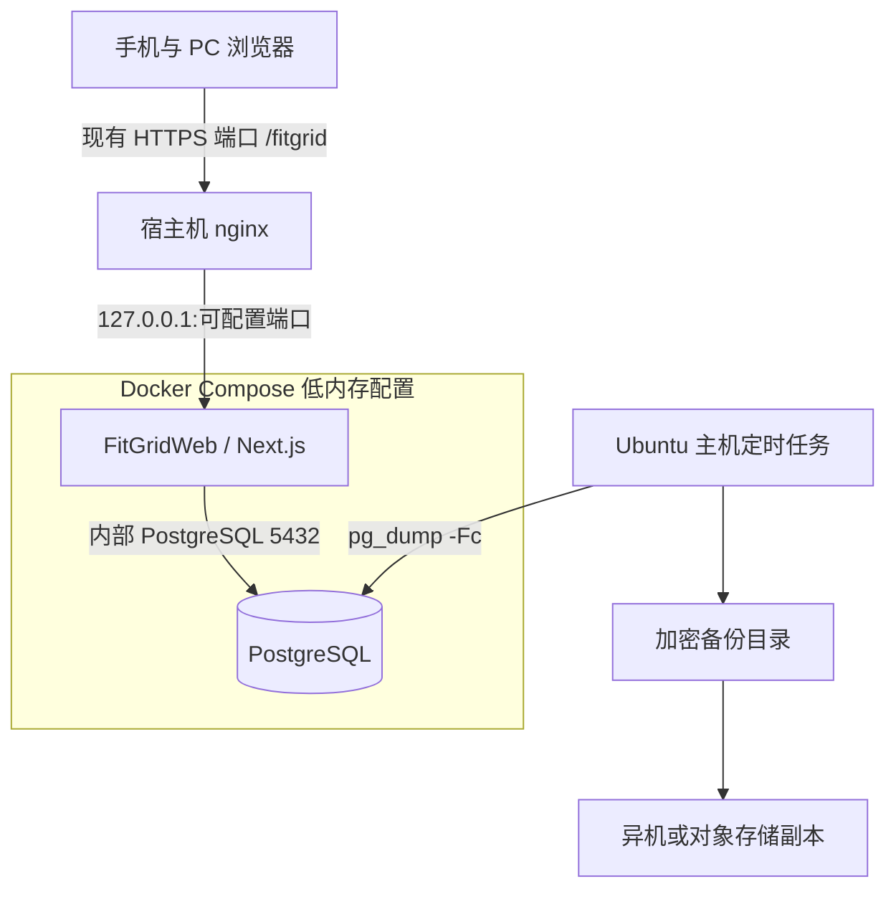

# Ubuntu VPS 部署、备份与迁移

> 当前小规模生产推荐方案是“现有 nginx + 固定 `/fitgrid` 子路径 + `docker-compose.low-memory.yml`”，完整实操以 [2 GiB VPS 一键部署与运维手册](low-memory-vps-runbook.md) 为准。仓库中的 Caddy 服务保留给独占域名/端口的独立部署，不会被低内存一键安装器启动。

## 1. 交付边界与命名

- 独立 GitHub 仓库名：`FitGridWeb`。
- 产品展示名：**F.I.T Grid Web**。
- 安卓仓库 `FitProj` 永远只作行为基线和兼容性取证，不作为 Web 仓库的 remote，也不接收 Web 提交。
- 本章定义 Web 实现阶段必须提供的 `compose.yaml`、`Dockerfile`、`Caddyfile`、`.env.example` 与 `ops/` 脚本行为；当前文档阶段不向安卓源码加入这些文件。
- 生产环境以云端 PostgreSQL 为唯一权威数据源，不支持浏览器离线写入或双向冲突合并。

## 2. 目标部署图



公网端口沿用现有 nginx 与 VPS 的实际配置，不由安装器写死或修改。Next.js 宿主映射只监听 `127.0.0.1`，PostgreSQL 只在 Compose 网络中可见；不得把 PostgreSQL 映射到公网。

## 3. 主机与 DNS 前置条件

建议最低配置为 Ubuntu 24.04 LTS、2 vCPU、2 GiB RAM、20 GiB SSD；实际容量按备份增长和访问量调整。

1. 创建仅使用 SSH 密钥的运维账号，禁用密码远程登录与 root 远程登录。
2. 确保现有 nginx vhost 已能通过 HTTPS 访问；Docker Engine 和 Compose plugin 可由安装器从 Docker 官方 apt 源安装。
3. 保持现有 SSH、防火墙、sing-box 和 nginx 监听策略；安装器不会更改这些配置。
4. 域名 A/AAAA 记录与已有 TLS 证书必须有效；安装器不签发或替换证书。
6. 将系统时区设为 UTC 或明确记录时区；应用与数据库时间统一存 UTC。

## 4. Compose 服务契约

| 服务 | 职责 | 必须配置 |
|---|---|---|
| `db` | PostgreSQL 权威存储 | 固定主版本、命名数据卷、`pg_isready` 健康检查、仅内部网络 |
| `app` | Next.js standalone 应用 | 非 root 用户、只读生产镜像、`/fitgrid/api/v1/health` 健康检查、宿主只绑定 loopback |
| 宿主 nginx | TLS 终止和反向代理 | 保留 `/fitgrid` 前缀并代理到 loopback；由用户选择现有单-server vhost |

基础 Compose 中的 `caddy` 是可选独立部署服务。低内存生产命令始终显式指定 `db app`，因此不启动 Caddy，也不占用公网 80/443。

应用镜像必须使用不可变版本标识，例如 Git 提交 SHA；禁止生产环境长期使用含义会变化的 `latest` 作为唯一回滚依据。数据库迁移角色与应用运行角色分离，运行角色不得拥有 `BYPASSRLS`。

## 5. 环境变量

`.env.example` 只列键名和安全说明，不含真实秘密。生产 `.env` 权限设为 `600`，不得提交 Git。

| 变量 | 用途 | 要求 |
|---|---|---|
| `DOMAIN` | 现有 nginx HTTPS 域名 | 不带协议、端口和路径 |
| `APP_BASE_PATH` | 生产子路径 | 固定 `/fitgrid` |
| `APP_PORT` | nginx 代理的本地端口 | 1024–65535，只绑定 loopback |
| `PUBLIC_HTTPS_PORT` | 现有 nginx HTTPS 端口 | 1–65535，不由安装器改写 |
| `APP_IMAGE` | 应用镜像及版本 | 公开 GHCR 的完整 SHA 标签 |
| `POSTGRES_DB` | 数据库名 | 生产专用 |
| `POSTGRES_USER` | 应用/所有者配置入口 | 不使用超级用户运行应用 |
| `POSTGRES_PASSWORD` | 数据库秘密 | 随机生成，不复用 |
| `DATABASE_URL` | Prisma 运行连接 | 仅容器内部地址 |
| `MIGRATION_DATABASE_URL` | 迁移连接 | 权限高于运行账号，单独保护 |
| `BETTER_AUTH_SECRET` | 会话签名/加密秘密 | 至少 32 随机字节 |
| `OWNER_REF_SECRET` | 用户备份 ownerRef HMAC | 与认证秘密分离 |
| `CURSOR_SIGNING_SECRET` | 分页游标签名 | 与其他应用秘密分别保管；安装器生成独立值 |
| `BACKUP_DIR` | server-key 备份本机目录 | 默认 `/var/lib/fitgridweb/backups` |
| `BACKUP_REMOTE_DIR` | 无人值守备份异机目标 | 首次为空；必须是与根设备不同的真实挂载 |
| `BACKUP_ENCRYPTION_KEY_FILE` | 备份加密密钥路径 | 主机 root 可读，不放环境值或 Git |
| `BACKUP_RETENTION_DAYS` | server-key 本机保留天数 | 默认 180；不控制远端保留 |
| `ADMIN_OPS_WEB_DIR` | app/worker 交换区 | 默认 `/var/lib/fitgridweb/admin-ops/web` |
| `ADMIN_OPS_ROOT_DIR` | worker 权威状态 | 默认 `/var/lib/fitgridweb/admin-ops/root`，不得挂入 app |
| `PORTABLE_BACKUP_DIR` | 最近便携备份 | 默认 `/var/lib/fitgridweb/portable-backups`，app 只读 |
| `PORTABLE_BACKUP_HISTORY_FILE` | 网页/CLI 共用历史 | 必须是 web status 下的 `backups.json` |
| `PORTABLE_BACKUP_MAX_BYTES` | 上传及展开上限 | 默认 536870912 字节（512 MiB） |
| `PORTABLE_BACKUP_READER_GID` | app 读取已发布备份的补充组 | 默认非 root 数字 GID 1001 |
| `LOG_LEVEL` | 日志级别 | 生产默认 `info` |

更换 `BETTER_AUTH_SECRET` 会使既有会话失效；更换 `OWNER_REF_SECRET` 会改变未来导出的匿名 ownerRef。轮换前必须记录影响。

## 6. 首次部署

标准流程如下：

```bash
curl -fsSLo /tmp/fitgridweb-install.sh \
  https://raw.githubusercontent.com/zhshy7713950/FitGridWeb/main/ops/install-production.sh
less /tmp/fitgridweb-install.sh
sudo sh /tmp/fitgridweb-install.sh
```

`ops/install-production.sh` 按顺序完成：

1. 校验必填变量、镜像版本和目录权限，拒绝默认密码或空秘密。
2. 匿名确认完整 SHA 镜像公开可拉取，在 VPS 上只拉取、不构建 Next.js。
3. 启动 `db` 并等待健康。
4. 使用迁移账号执行 `prisma migrate deploy`；失败时停止，不启动新应用。
5. 启动 `app`，写入受管 nginx include 并用 `nginx -t` 验证。
6. 在 loopback 和公网分别检查 `/fitgrid/api/v1/health`。
7. 输出部署版本、迁移版本和检查结果，不回显秘密。

`admin:create` 必须交互读取密码，禁止通过命令参数或 shell history 传递；只有数据库中不存在任何用户时才能创建无邀请的首个管理员。此后管理员只通过一次性邀请创建账号。

## 7. 健康检查与上线验收

`GET /api/v1/health` 区分：

- 存活：进程能响应。
- 就绪：数据库可连接且必要迁移已应用。

就绪失败返回 503 和公开错误码，不返回数据库地址、版本细节或异常堆栈。首次上线至少执行：

```bash
systemctl status fitgridweb
docker compose --project-name fitgridweb --env-file /etc/fitgridweb/fitgridweb.env \
  -f docker-compose.yml -f docker-compose.low-memory.yml ps
curl --fail --silent --show-error https://<domain>[:port]/fitgrid/api/v1/health
journalctl -u fitgridweb --since=-10m
```

随后用两个测试账号执行 [账号隔离验收](08-traceability-and-acceptance.md#5-安全与账号隔离矩阵)，再导入一份 Android JSON 并核对黄金算法结果。

## 8. 日常升级与回滚

### 升级

1. 在测试环境运行单元、契约、算法黄金用例、隔离和迁移测试。
2. 生成不可变应用镜像并记录旧/新 SHA。
3. 执行升级前数据库备份并校验文件。
4. 评审 Prisma migration：首选向后兼容的 expand/migrate/contract 方式。
5. 运行 `/opt/fitgridweb/ops/install-production.sh --upgrade`，选择目标公开 Git ref。
6. 执行健康检查、登录、列表、计算、导入/导出冒烟测试。

### 回滚

- 无数据库结构破坏时，将 `APP_IMAGE` 改回上一 SHA 并重新部署。
- 新旧应用不能共用新结构时，先进入维护模式，再从升级前备份恢复到独立数据库验证；禁止对生产库盲目执行手写逆向 SQL。
- 恢复数据库会丢弃备份时间点后的写入，必须由运维负责人明确确认恢复点。
- 回滚完成后重新跑隔离与算法冒烟测试。

## 9. 完整备份策略与权限边界

用户 JSON 导出是单账号迁移文件，不替代完整灾难恢复。完整备份覆盖 Better Auth 用户/密码哈希/会话、角色与状态、邀请、网格产品、导入预检、schema、RLS 和 Prisma 迁移记录；不包含 nginx、TLS 私钥、系统日志、Docker 镜像、`fitgridweb.env`、VPS 凭据或应用秘密。

实现提供两条不同路径：

- 便携路径：管理员页面或 root TTY 运行 `sudo /opt/fitgridweb/ops/backup-portable.sh`，使用独立 12–128 字符 passphrase 的 age 文件 `fitgridweb-YYYYMMDDTHHMMSSZ.fitgridbackup`。明文 tar 只含 `manifest.json`、`database.dump`、`database.dump.sha256`。文件通过 dump 可读性、内部 checksum、加密后解密复检和 reader 权限发布后，才加入 `/var/lib/fitgridweb/portable-backups` 与共享网页历史；成功历史最多 5 条。
- 无人值守路径：`/opt/fitgridweb/ops/backup.sh` 使用 root-only `/etc/fitgridweb/backup.key` 做 AES-256-CBC/PBKDF2 加密，生成 `.dump.enc`、`.dump.enc.sha256`、`.json` 并复制到真实 `BACKUP_REMOTE_DIR`。timer 每天 02:30、persistent、最多随机延迟 10 分钟。该路径不写网页历史，也不受 5 份限制；本机默认 180 天清理只发生在远端复制及远端 checksum 成功之后，远端保留由存储侧负责。

应用容器只获得 UID/GID 1001 的 web spool 可写挂载和便携目录只读挂载；没有 Docker socket、migration URL、服务器环境文件、backup key 或 root 状态树。`fitgridweb-maintenance.path` 监视固定 inbox，root oneshot worker 串行处理固定 schema 的 `backup`、`inspect-restore`、`restore`，审计写入 `/var/lib/fitgridweb/admin-ops/root/audit.jsonl` 并由 logrotate 保存 180 个 daily rotation。

真实异机 timer 只应在 `BACKUP_REMOTE_DIR` 为安全绝对路径、非 `/`、现有非 symlink 可写目录、`realpath` 成功且 `findmnt` 设备不同于 `/` 时启用。安装器首次默认禁用；挂载后来失效时 unit 不会自动识别，必须监控并立即 `systemctl disable --now fitgridweb-backup.timer`。完整配置、checksum 和 enable/disable 命令见 [2 GiB 手册](low-memory-vps-runbook.md#配置真正的异机定时备份)。

固定检查命令：

```bash
systemctl status fitgridweb-maintenance.path --no-pager
systemctl status fitgridweb-backup.timer --no-pager
journalctl -u fitgridweb-maintenance.service --since today --no-pager
journalctl -u fitgridweb-backup.service --since today --no-pager
```

## 10. 网页整库恢复与故障模型

管理员在 `/fitgrid/admin` 的“数据保险库”完成：当前密码重新验证并创建便携备份 → 最近 5 份中申请 60 秒、单次、绑定管理员/备份的下载 → 上传 `.fitgridbackup` 与独立密码 → 隔离预检 → 在固定 10 分钟挑战内再次输入当前密码和准确短语 `恢复全部数据`。预检成功只公开备份时间、PostgreSQL 主版本、数据库和四项计数；manifest 内的 app image 与浏览器文件大小不作为公开服务器证明。

恢复执行顺序固定为：重新验证准备 dump 摘要/可读性 → 创建、加密、解密复检恢复前快照 → root 权威维护标记 → 停 `app` → 终止运行角色连接 → `pg_restore --clean --if-exists --no-owner --exit-on-error --single-transaction` → Prisma migration → 删除全部 `sessions` → 启动 `app` → 回环及公网健康。成功后所有用户重新登录，且触发恢复的临时管理员可能已不存在。

任一步失败只自动回滚一次。回滚成功仍报告原 restore `failed/RESTORE_FAILED` 与 `rolledBack=true`；回滚失败、中断或关键状态发布失败进入 `intervention-required`。权威 `/var/lib/fitgridweb/admin-ops/root/maintenance.json` 保持 active，重启不会自动继续。保留目录 `/var/lib/fitgridweb/admin-ops/root/intervention/{jobId}` 含 identifier-only `job.json`，若快照已生成还含 server-key 加密的 `rollback.dump.enc`；密码、上传和明文不会作为恢复材料保留。

没有通用安全的原地解除 intervention 命令。操作员应保留 job/request ID，读取 unit 状态、journal、root marker、公开 job status 和 intervention 文件权限；不得编辑 marker、删除 evidence、随意 chmod/chown、重复恢复或直接把加密文件交给 `pg_restore`。无法证明故障主机的唯一权威状态时，在新隔离主机从最后已验证备份恢复并验收。精确诊断命令和警告见 [2 GiB 手册](low-memory-vps-runbook.md#恢复失败自动回滚和人工介入)。

当前 worker 公网健康探针固定访问 `https://$DOMAIN/fitgrid/api/v1/health`，因此自动生产恢复要求该地址在 443 可达；仅使用非标准 HTTPS 端口的部署在修复并重验探针前不得执行网页生产恢复。

## 11. 季度演练与 VPS 更换

至少每季度在独立、可销毁且不共享生产 project/volume/env/port/mount/DNS 的环境执行真实恢复。仓库脚本固定 Compose project 名 `fitgridweb`，所以不能靠外层传一个 `fitgridweb-drill` 名称在生产 Docker 主机上隔离；脚本级演练应使用没有既有 FitGrid 资源的独立 VM/VPS。演练必须记录真实备份恢复点、最后包含写入、确认/完成时间、实测 RPO/RTO、实际 image digest/PostgreSQL `version()`、外层 checksum、恢复前后计数、session 清除、A/B RLS/404、Android v2.1.0 重算、健康、2 GiB 内存和准确销毁清单。没有测量就标“未测量”，不能把配置值或单元测试冒充生产结果。

更换 VPS 的强制顺序是：

1. 提前降低 DNS TTL，记录并评审旧站完整 SHA、镜像、PostgreSQL/迁移版本和恢复点；冻结写入，创建最终 portable backup，下载并核对外层 SHA-256，密码分渠道传递。
2. 新 VPS 安装完全相同 reviewed SHA 和对应 GHCR SHA image，在空库创建临时管理员；DNS 暂不切换。
3. 通过 TLS 有效的受控运维访问登录新站，上传、预检 portable backup 并核对时间、PostgreSQL 主版本、数据库及四项计数，再精确确认整库恢复。
4. 恢复后用备份中原有管理员登录；临时管理员被整库替换且所有 session 已清除。
5. 需要连续性时，`BETTER_AUTH_SECRET`、`OWNER_REF_SECRET`、`CURSOR_SIGNING_SECRET` 通过与备份不同的安全通道分别迁移；不要覆盖新主机数据库凭据/路径/key。重启并再次登录验证。
6. 验证回环/公网健康、管理员、A/B 隔离、已知 grids、Android v2.1.0 重算、导入导出、maintenance path、真实 off-host backup/checksum，之后才切换 DNS。
7. 旧 VPS 至少 72 小时不再接受写入并保留原磁盘/卷。仓库没有通用只读切换脚本；没有经审核的代理只读规则时，应停旧应用而不是让双写发生。若新站已接受写入，回退前先选定唯一权威时间线，不能自动双向合并。

便携恢复不需要旧 `backup.key`；恢复 `backup.sh` 历史则必须另行迁移对应 key。禁止直接复制 Docker volume 替代逻辑备份/恢复。完整逐步流程与记录模板见 [2 GiB 手册](low-memory-vps-runbook.md#完整更换-vps)。

## 12. 运维安全清单

- 每月安装 Ubuntu 与 Docker 安全更新，在备份完成后安排重启窗口。
- 监控磁盘、数据库连接、健康检查、HTTP 5xx、登录限流和备份结果。
- 日志不记录密码、Cookie、邀请 token、上传 JSON 正文或完整 ownerRef。
- 禁止把生产数据库复制到个人电脑作普通调试；演练数据按生产数据保护。
- 管理员面板不提供读取用户产品的接口，运维 SQL 访问须审计并仅用于故障处理。
- 禁用最后一个有效管理员、删除业务账号、恢复生产库等高风险动作必须有二次确认和审计记录。
